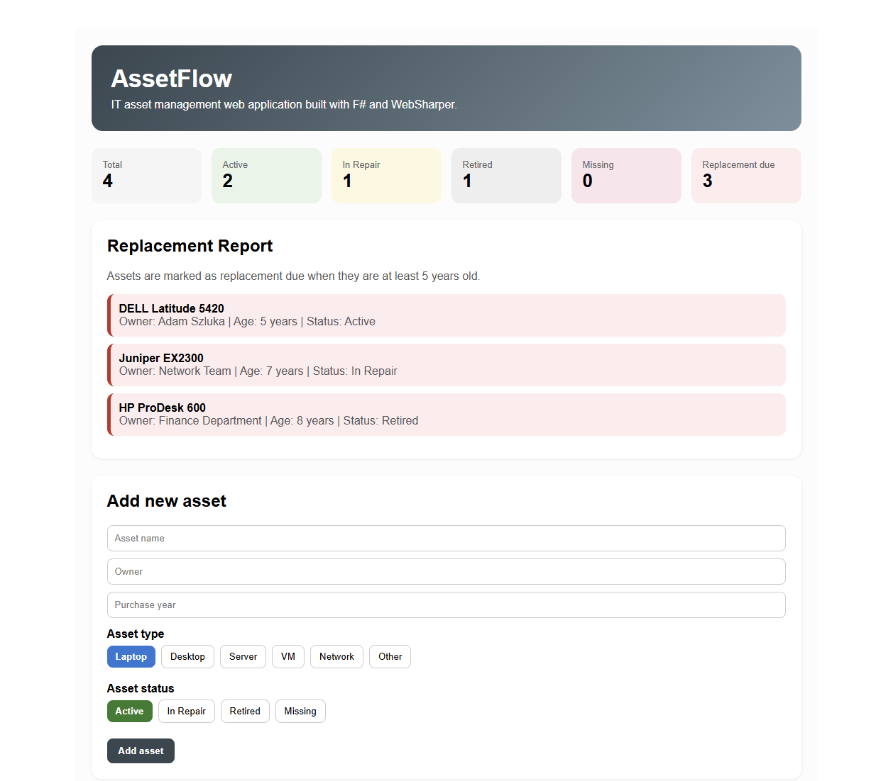
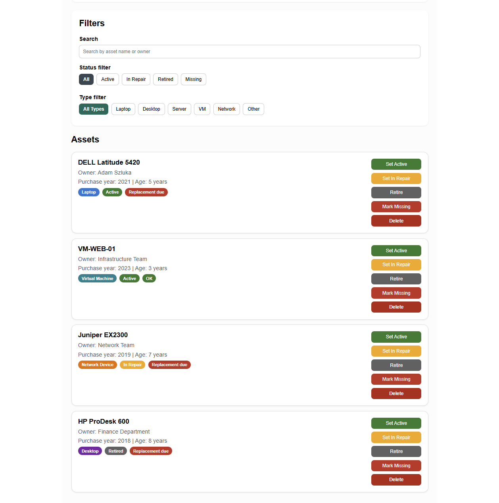

# AssetFlow

AssetFlow is an IT asset management web application built with F# and WebSharper.

The goal of the project is to help track IT devices, their owners, statuses, purchase years, replacement needs, and basic asset statistics in a simple and interactive way.

## Motivation

In an IT environment, it is important to keep track of devices, owners, statuses, and replacement cycles. AssetFlow was created as a simple web-based tool for managing IT assets and demonstrating functional programming concepts in F#.

This project was developed as a separate Project Omega assignment.

## Features

- Add new IT assets
- Select asset type
- Select asset status
- Track owner and purchase year
- Calculate asset age automatically
- Detect assets that are due for replacement
- Update asset status
- Delete assets
- Filter assets by status
- Filter assets by type
- Search by asset name or owner
- View advanced statistics
- View a replacement report

## Technologies

- F#
- .NET 10
- WebSharper
- ASP.NET Core

## Functional programming aspects

This project uses several functional programming concepts:

- record types for asset data
- discriminated unions for asset type, asset status, and filters
- pattern matching
- immutable-style record updates
- list transformations with `List.map` and `List.filter`
- reactive state handling with `Var` and `View`

## Project Description

AssetFlow is a web application for managing IT assets. The application allows users to track devices such as laptops, desktops, servers, virtual machines, and network devices.

Each asset contains a name, owner, asset type, status, and purchase year. The application automatically calculates the age of each asset and determines whether it is due for replacement. Assets that are at least five years old are marked as replacement due.

The application provides several interactive features. Users can add new assets, update their status, delete assets, search by asset name or owner, and filter the inventory by type or status. The dashboard also displays statistics, including the total number of assets, active assets, assets in repair, retired assets, missing assets, and assets due for replacement.

The implementation uses F# and WebSharper. The core logic is written in F#, while the JavaScript output is generated by WebSharper. The project demonstrates functional programming concepts such as discriminated unions, records, pattern matching, immutable-style updates, and list transformations.

## Build and run locally

```bash
cd AssetFlowApp
dotnet build
dotnet run
```

## Then open:
http://localhost:5000

## Screenshots

### Dashboard and statistics



### Asset management and filters



## Live Demo
-To be added.